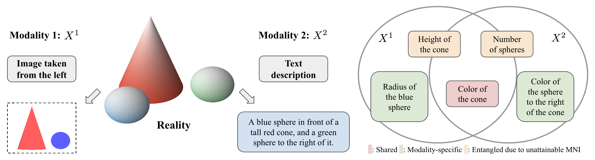
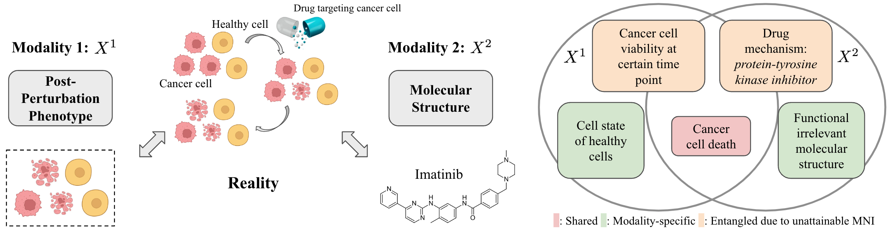
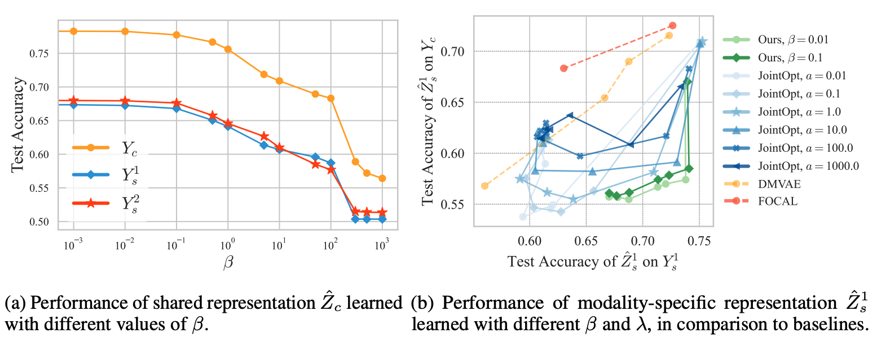

# An Information Criterion for Controlled Disentanglement of Multimodal Data

The repository contains the code for the `DisentangledSSL` method presented in the paper: *[An Information Criterion for Controlled Disentanglement of Multimodal Data](https://arxiv.org/abs/2410.23996) (ICLR 2025)*. `DisentangledSSL` is a novel self-supervised approach for learning disentangled representations, separating information shared across different modalities and modality-specific information.

An example in vision-language domain:



An example in the biological domain:




## Set up the environment

```
conda create -n multimodal python=3.10.9
conda activate multimodal
bash env.sh
```

## Simulation Study
The code is in the `synthetic_task/` folder. The command for `DisentangledSSL` (both step 1 and step 2) and baselines can be found in `scripts/`.

```
bash scripts/run_step1.sh
bash scripts/run_step2.sh
```



## Citation
If you find this work useful in your research, please cite:

```
@article{wang2024information,
  title={An Information Criterion for Controlled Disentanglement of Multimodal Data},
  author={Wang, Chenyu and Gupta, Sharut and Zhang, Xinyi and Tonekaboni, Sana and Jegelka, Stefanie and Jaakkola, Tommi and Uhler, Caroline},
  journal={arXiv preprint arXiv:2410.23996},
  year={2024}
}
```